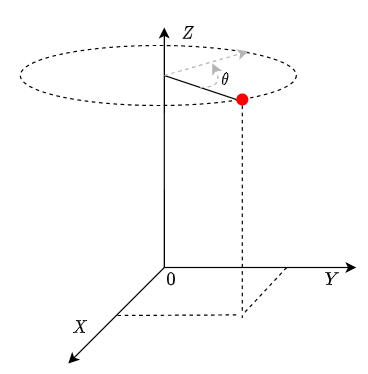

## 임의의 축에 대한 회전

<p align="center">  </p>

원점을 기준으로 점 $(x,y,z)$을 $Z$축으로 $\theta$만큼 회전시키는 수식은 다음과 같이 행렬로 표현할 수 있습니다.

$$\begin{bmatrix}
x'\\
y'\\
z'
\end{bmatrix}=
\begin{bmatrix}
cos(\theta)& -sin(\theta)&0\\
sin(\theta)&cos(\theta)&0\\
0&0&1
\end{bmatrix}
*
\begin{bmatrix}
x\\
y\\
z
\end{bmatrix}$$

그리고 $X$ 혹은 $Y$ 축으로 회전한다면 행렬이 바뀌게 됩니다.

$X$축에 대한 회전 = 

$$\begin{bmatrix}
x'\\
y'\\
z'
\end{bmatrix}=
\begin{bmatrix}
1 & 0 & 0\\
0 & cos(\theta)& -sin(\theta) \\
0&sin(\theta)&cos(\theta)
\end{bmatrix}
*
\begin{bmatrix}
x\\
y\\
z
\end{bmatrix}
$$

$Y$축에 대한 회전 =

$$\begin{bmatrix}
x'\\
y'\\
z'
\end{bmatrix}=
\begin{bmatrix}
cos(\theta) & 0 & sin(\theta)\\
0 & 1& 0 \\
-sin(\theta)&0&cos(\theta)
\end{bmatrix}
*
\begin{bmatrix}
x\\
y\\
z
\end{bmatrix}
$$

좀더 일반적으로 점$(x,y,z)$을 임의의 축으로 회전하는 것을 생각해볼때 $X,Y,Z$축으로 회전하는 행렬로는 표현하기가 어렵습니다.

대부분의 3D Library에서는 축 회전에 대한 클래스를 제공하는데 eyeshot에서는 Rotation이  해당 클래스입니다. 아래는 점 $(x,y,z)$를 $Z$ 축으로 $\theta$ 만큼 회전하는 코드입니다. 

```cs
var pos = new Vector3D(x,y,z);
var rotation = new Rotation(theta, Vector3D.AxisZ);
pos.Transformby(rotation);
```

$\overrightarrow{(1,1,1)}$ 축으로 회전하려면 아래와 같이 할 수 있습니다.

```cs
var pos = new Vector3D(x,y,z);
var rotation = new Rotation(theta, new Vector3D(1,1,1);
pos.Transformby(rotation);
```

이렇게 간결한 코드로 점$(x,y,z)$을 임의의 축으로 회전시킬 수 있습니다.

<a class="post-tag btn btn-outline-primary" href="/tags/%EA%B9%83%ED%97%88%EB%B8%8C%EB%B8%94%EB%A1%9C%EA%B7%B8/">깃허브블로그</a>

[^1]: My reference.
[^2]: To add line breaks within a footnote, prefix new lines with 2 spaces.
  This is a second line.
